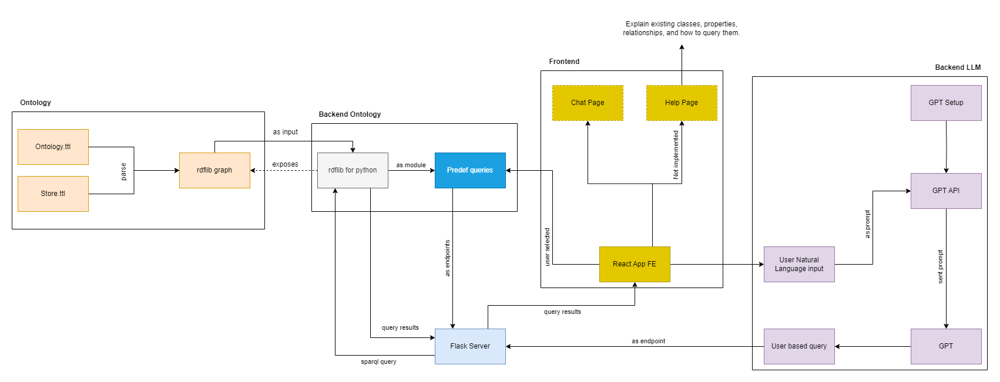
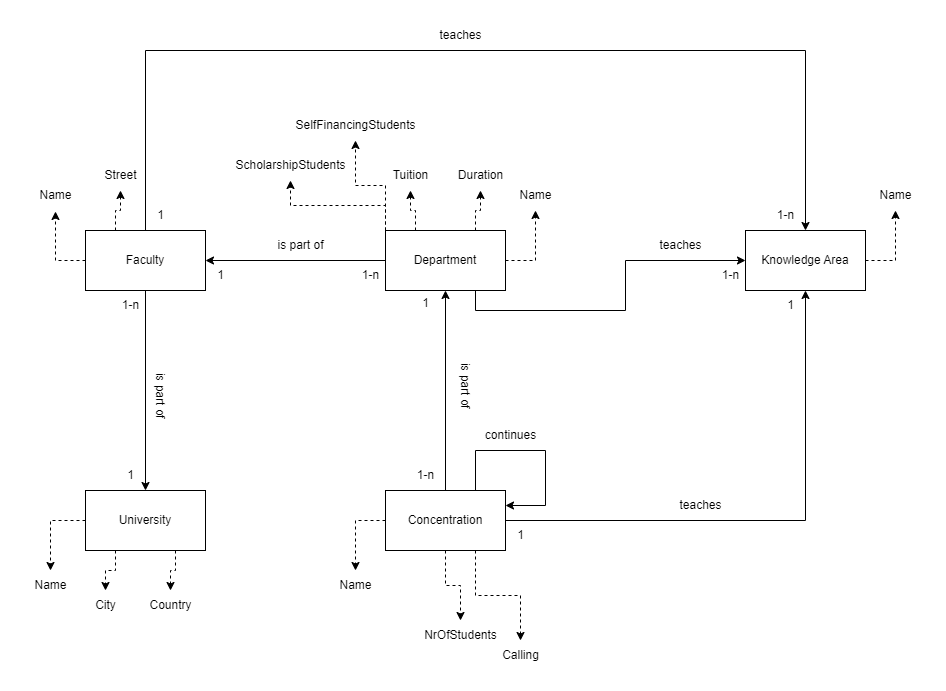

# Faculty-Choice-Assistant

Assistant that helps highschool students choose the faculty that best suits their interests, or, just gives insights into different universities, faculties and their departments.

## System Architecture

The image below shows the current system architecture present in the repository.



The project is divided into three main parts. Backend, Frontend and Ontology. Backend houses the Flask server, the OpenAI API that communicates with a ChatGPT assistant, abstractions of SPARQL queries on the ontology's graph as well as a few predefined queries. Frontend has the page set up and ontology has the ontology and store turtle files.

## Ontology

The repository offers the ontology and store RDF files, written in turtle syntax, for use and expansion. They can be found within the ontology folder. The overview of the ontology in graph form can be seen in the image below.



In short, present in the ontology are:

* University, Faculty, Department, Concentration and KnowledgeArea classes
* FacultyisPartOf, DepartmentisPartOf, ConcentrationisPartOf, ConcentrationContinues, FacultyTeaches, DepartmentTeaches and ConcentrationTeaches object properties
* isNamed, isInCity, isInCountry, isOnStreet, hasScholarshipStudents, hasSelfFinancingStudents, hasTuition, hasDuration, hasCalling and hasNrOfStudents datatype properties

The store has individuals of these classes, mostly focusing on the Faculty of Technical Sciences in Novi Sad, but also offering around a myriad of other faculties and departments.

Before using, in the prefix of both *ontology.ttl* and *store.ttl*, **change** **@PREFIX for edu to the path of the file on your local PC since the ontology is not uploaded to the web.**

## Backend

Backend is comprised of three main modules. the llm module works with GPT and OpenAI API, the ontology handles making SPARQL queries and actually querying the RDF graph and lastly, the server module defines all the endpoints and a Flask server for communication.

### LLM Module

The *assistant.py* file defines constants such as your OpenAI API Key, the client with which the server will communicate and the assistant that will be used. The assistant, for ease of use and experimentation, was made through the OpenAI Web API by hand, not through a script, therefore in code the assistant constant is defined just through its ID. The ID can be found in the assistant information or on the page of all registered assistants for your OpenAI API account. When creating the assistant, the file of the ontology is given to it. In the TOOLS section of the assistant, the *Retrieval* option is enabled. A retrieval tool assistant will try to reason upon a file that it is given and return information about it, this being the SPARQL queries.

*threads.py* actually does all the messaging. First, a thread is created for each user that enters the online service, this is so that users don't compete with each other for answers, send messages at the same time to the same queue or so that the assistant has just the context of a single user. Once the thread is instantiated, a setup message is sent to add further context to the assistant. Each subsequent user message is wrapped in context that just reiterates that the assistant should write a SPARQL query for the user message. After sending the message in the thread queue, a run is made that executes the assistant on those messages. Each time a user message is sent, a new run has to be made, a run is complete when its status is *completed* which is checked in a while loop, thus losing out on asynchronicity, due to it not being a feature for assistants yet, at the time of writing. Then the newest message is taken from the queue of the run and parsed for the special markdown segment for SPARQL, in which the query itself will be housed.

### Ontology Module

*load_ontology.py* just defines the global variable for the graph that will be queried, and loads the contents of both the ontology and the store.

*queries.py* applies a string that represents the query on to the global Graph, and also cleans the results that *rdflib* returns and makes them into a dictionary, for easier json packing and later unpacking for table creation.

*predef_queries.py* and *predef_queries_dict.py* define the predefined queries that will be used as examples.

### Server module

The server consists of two groups of endpoints. Each in its own .py file and with its own blueprint. The first group is *predef_queries* a single endpoint that just calls a specific predefined query using the *predef_query_dict*. The second blueprint is for handling assistant related functions. The blueprints are as follows:

* Blueprint: **predef_queries**

  * prefix: **/predef_queries**
  * endpoints: **/**
* Blueprint: **llm**

  * prefix: **/chat**
  * endpoints: **/setup, /message, /query_results**

The endpoints are as follows:

* Endoint: **/predef_queries/**

  * method: **GET**
  * query parameters: **query=one of the keys from the predef_queries_dict**
  * returns: **JSON of query results** **|** **400 if no query parameter**
  * description: Calls the predefined query from the method parameter, applies it to the graph and returns the results
* Endpoint: **/chat/setup**

  * method: **GET**
  * query parameters: **None**
  * returns: **JSON with thread_id and run_id**
  * description: Makes a thread for the user, sends the setup message to the thread and runs it, returning both the run and thread ids.
* Endpoint: **/chat/message**

  * method: **POST**
  * body: **JSON with thread_id, run_id and msg**
  * returns: **JSON with thread_id and run_id | 400 if bad body**
  * description: Retrieves the thread and current run for user, sends the msg parameter to the run, exectures the run and returns the executed run id alongside the thread
* Endpoint: **/chat/query_results**

  * method: **GET**
  * query parameters: **thread_id and run_id returned from /message**
  * returns: **JSON with query results | JSON with just "No answer for query" | 400 if bad query parameters**
  * description: Retrieves the thread and run for that thread, parses the SPARQL markdown from the run responses, applies that query and returns the results

### Running the backend server

Before starting the server first use pip to install the provided requirements.txt to be able to run the server.

```powershell
cd backend
pip install -r requirements.txt
```

Also replace the API key and Assistant id in the llm module, and the prefix in the ontology module.

From the root of the project (which should be ~/Faculty-Choice-Assistant) run the following python command to run the server on localhost:5001

```powershell
python -m backend.server.app
```

## Frontend

Not much to say about this. There is a panel on the left side of the screen that has buttons for the predefined queries. A textbox that *tries* to emulate what ChatGPT does on its frontend as well as a message box to send messages. When an assistant writes something, that message will have the *Assistant:* prefix, for the user, much the same, with *User:*. All the code is in App.js for ease of use since it's a really simple single page app.

To run the frontend server first install all the dependencies from package.json *(assuming you are starting from the root folder, and that you have Node)*

```powershell
cd frontend
npm install
```

Then just run the following command to open the frontend on localhost:3000.

```powershell
npm start
```
